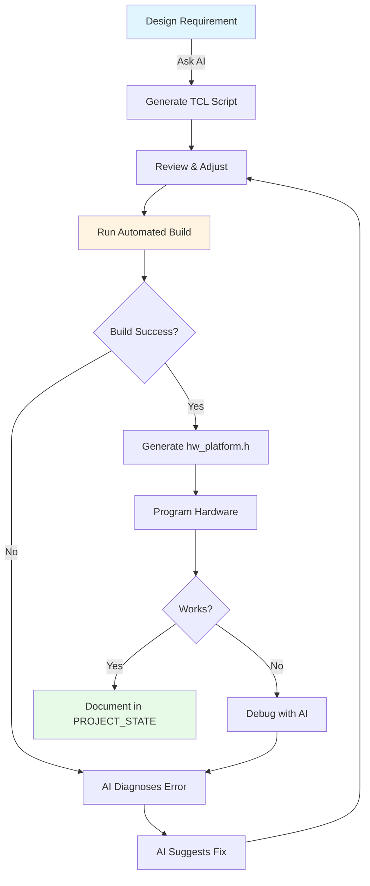
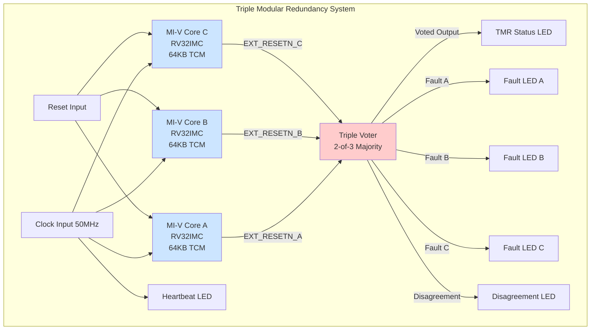

# TCL Monster Presentation Content
**Organized by Slide - Copy/Paste Ready**

---

## SLIDE: Automation Tooling Stack

### Foundation: Script-Based Automation
**Bash Scripts**
- Build orchestration (build_miv_tmr.sh)
- Workflow automation
- WSL/Windows path translation

**TCL Scripts (75+)**
- Libero project creation
- IP core configuration
- Synthesis/P&R execution
- Direct tool control

### Integration: Interactive Automation Tools
**PowerShell Serial Automation**
- BeagleV-Fire board interaction
- File-based command queue pattern
- Autonomous board control (no Putty needed)

**Python Utilities**
- Memory map parsing (hw_platform.h)
- Report extraction and analysis
- Code generation

### Intelligence: AI/Agentic Layer
**Current:** Claude Code, ChatGPT, Gemini CLI
**Future:** Microchip CLI Tool (internal Azure instance)

**Stack Visualization:**
```
AI/Agentic Layer (Claude Code → MCHP CLI)
         ↓
Automation Tools (PowerShell, Python)
         ↓
Script Foundation (Bash + TCL, 15k+ lines)
         ↓
Tools (Libero SoC, Synplify Pro)
```

---

## SLIDE: AI Capabilities vs. Limitations

### LEFT PANEL: What AI Can Do

**Project Creation & Management**
- Generate complete TCL scripts for project setup
- Configure IP cores with correct parameters
- Create build flows (synthesis → P&R → bitstream)
- Generate constraints (PDC/SDC) from specifications

**Code Generation**
- Write Verilog/VHDL modules from descriptions
- Create TCL functions for repetitive tasks
- Generate Python utilities for parsing/analysis
- Produce working code on first attempt (high success rate)

**Problem Solving**
- Diagnose errors from build logs
- Research solutions in vendor documentation
- Design workarounds for tool limitations
- Document lessons learned automatically

**Documentation Mining**
- Search 2000+ pages of FPGA documentation instantly
- Find relevant examples and specifications
- Extract timing requirements and constraints
- Provide page references and context

### RIGHT PANEL: What AI Cannot Do (Manual Required)

**GUI-Only Operations**
- SmartDesign canvas creation **[Workaround: Direct HDL]**
- Interactive component connections **[Workaround: TCL where possible]**
- Visual constraint editors **[Workaround: Hand-edit PDC/SDC]**

**Physical Hardware**
- Board setup and connections **[Manual: One-time setup]**
- JTAG programming **[Workaround: FlashPro automation possible]**
- Oscilloscope measurements **[Manual: Verification step]**

**Context Engineering Challenges**
- Long build logs (50k+ tokens) **[Workaround: Filter + summarize]**
- Large PDF documentation **[Workaround: RAG system (FPGA MCP)]**
- Multi-session continuity **[Workaround: PROJECT_STATE.json]**

**Tool-Specific Limitations**
- Libero license checkout **[Manual: Run on licensed machine]**
- Path conversion (Windows ↔ WSL) **[Workaround: wslpath automation]**
- Binary file analysis **[Manual: Use vendor tools]**

---

## SLIDE: Context Management Workarounds

### The Problem
**Token Limits Impact Development:**
- 200k context window = ~4 hours of work
- Build logs can consume 50k+ tokens
- Documentation PDFs = 10k+ tokens per read
- Multi-day projects lose continuity

### Solution 1: FPGA MCP RAG System

**What It Is:**
- Semantic search over 2,500+ pages of PolarFire documentation
- 4,999 document chunks indexed with embeddings (36 documents)
- ChromaDB vector store + BAAI/bge-small-en-v1.5 model

**Impact:**
- 90% reduction in documentation token cost
- Query: "DDR4 timing constraints" → Instant relevant excerpts
- Similarity scores: 0.75-0.87 (high quality matches)
- Only loads what's needed vs. reading entire PDFs

**Usage Pattern:**
```
Query FPGA MCP → Get relevant 3-5 chunks → Use in design
vs.
Read entire 300-page PDF → Search manually → Extract info
```

**Before:** 50k+ tokens to read docs
**After:** 2-3k tokens for targeted queries

### Solution 2: Structured State Management

**PROJECT_STATE.json**
- Session-independent knowledge base
- Survives context compaction
- Architecture decisions + lessons learned
- 5-10k tokens vs. 100k+ for full history

**Session Documentation**
- docs/sessions/ for historical reference
- docs/lessons_learned/ for patterns
- Only loaded when needed

### Solution 3: Strategic Tool Usage

**What to Avoid:**
- Reading same file multiple times
- Loading unused MCP tools (7k+ token overhead each)
- Verbose build logs (filter first)

**What Works:**
- Query-based documentation access (FPGA MCP)
- Incremental state updates (PROJECT_STATE.json)
- Selective file reading (only when changed)

**Result:** 4-hour sessions without hitting limits

---

## SLIDE: Real-World Workflow Example

### Scenario: Adding PCIe to Existing Design

**Traditional GUI Approach (60+ minutes):**
1. Open Libero → Navigate to IP Catalog
2. Find PF_PCIE core → Configure via dialog boxes
3. Create SmartDesign canvas → Add component
4. Connect AXI/AHB buses manually → Wire clocks
5. Add constraints → Run synthesis
6. Debug errors → Repeat steps 3-5

**AI-Assisted CLI Approach (15 minutes):**

```bash
# 1. Generate PCIe configuration (2 min)
claude: "Generate TCL for PF_PCIE Gen2 x4 endpoint with AXI master"
→ AI produces complete TCL script with correct parameters

# 2. Integrate into project (1 min)
./run_libero.sh tcl_scripts/add_pcie.tcl SCRIPT

# 3. Automated build (12 min)
./build_project.sh
→ Synthesis + P&R runs hands-off

# 4. Review (optional)
claude: "Analyze build report, any timing issues?"
→ AI parses logs, identifies problems
```

**Key Differences:**
- No GUI navigation required
- Configuration auto-calculated (lane width, clocking)
- Build reproducible (version controlled TCL)
- AI catches errors before hardware testing

### Workflow Diagram



---

## SLIDE: TMR Demo - Complexity Handled Automatically

### System Architecture



### Build Command

```bash
./build_miv_tmr.sh
```

**What Happens (Automated):**
1. Creates Libero project for MPF300
2. Configures 3x MI-V RV32IMC cores (identical settings)
3. Imports custom voter HDL modules
4. Creates top-level HDL wrapper (tmr_top.v)
5. Adds constraints (I/O pins, timing, synthesis attributes)
6. Runs synthesis + Place & Route
7. Generates bitstream

**Time:** 45 minutes (mostly synthesis)
**User Effort:** One command, hands-off

**Key Innovation:** AI discovered SmartDesign TCL couldn't instantiate custom HDL, designed direct HDL workaround in <1 hour

---

## SLIDE: hw_platform Toolkit - Standalone Automation

### The Problem
After FPGA design changes, firmware needs updated memory map:
- Peripheral base addresses (UART, GPIO, timers)
- Memory regions and sizes
- Clock frequencies
- IRQ assignments

**Manual Process: 30+ minutes**
1. Open SmartDesign in Libero GUI
2. Navigate menus to export memory map
3. Open exported file, read addresses
4. Hand-edit C header with #defines
5. Update clock frequency separately
6. Copy to firmware project

### The Solution

```bash
./scripts/generate_hw_platform.sh project.prjx MIV_RV32 ./output 100000000
```

**Automated Steps:**
1. Opens Libero project via TCL (headless)
2. Exports memory map to JSON
3. Parses JSON with Python
4. Generates hw_platform.h with correct addresses
5. Includes configurable clock frequency

**Result: 30 seconds**

### Generated Output

```c
// Auto-generated hw_platform.h
// Generated: 2025-11-24 08:15:23

#define SYS_CLK_FREQ        100000000  // 100 MHz
#define UART0_BASE_ADDR     0x70001000
#define GPIO_BASE_ADDR      0x70002000
#define TIMER0_BASE_ADDR    0x70003000
#define TCM_BASE_ADDR       0x80000000
#define TCM_SIZE            0x00010000  // 64 KB

// APB Peripheral offsets
#define UART0_IRQ           10
#define GPIO_IRQ            11
#define TIMER0_IRQ          12
```

**Value:**
- Not AI-dependent (works standalone)
- Version controlled
- Eliminates manual transcription errors
- Integrates with CI/CD pipelines

---

## SLIDE: Quantified Impact

### Time Savings (Real Measurements)

| Task | Before | After | Savings |
|------|--------|-------|---------|
| FPGA Build Iteration | 60 min | 15 min | 75% |
| BeagleV-Fire Development | 60 min | 20 min | 70% |
| Firmware Integration | 30 min | 30 sec | 99% |
| Documentation Lookup | 10-20 min | 10 sec | 90-95% |
| TMR System Design | 8 hours | 1 hour | 87% |

### Weekly Savings (Active Development)
**5 build iterations:** 3.75 hours saved
**3 BeagleV tests:** 2 hours saved
**10 firmware updates:** 5 hours saved
**50 doc lookups:** 8 hours saved
**Total: 18+ hours per week**

### Lessons Learned (Documented)
- SmartDesign HDL instantiation limitation
- Constraint file association (organize_tool_files required)
- Path handling quirks (Windows vs. WSL)
- Synthesis attribute syntax for TMR
- Error checking too strict (warnings ≠ errors)

**All documented in ROADMAP.md and lessons_learned/**

---

## SLIDE: Scaling - Simple to Complex

### Same Automation, Any Complexity

**Simple: Counter**
- 33 LUTs, 32 FFs
- Build time: 2 minutes
- One command: `./create_instant_fpga.sh mpf300_eval counter`

**↓ Same automation pattern ↓**

**Complex: MI-V RISC-V**
- 11,607 LUTs, 5,644 FFs
- Build time: 25 minutes
- One command: `./build_miv_rv32.sh`

**↓ Same automation pattern ↓**

**Advanced: TMR (3x RISC-V + Voter)**
- Triple redundancy for high-reliability
- Build time: 45 minutes
- One command: `./build_miv_tmr.sh`

### Key Point
**Same TCL patterns scale from LED blink to fault-tolerant systems**

---

## SLIDE: Next Steps & Transition

### Current State (External AI)
- Claude Code (Anthropic) - requires subscription
- Scripts work standalone (no AI needed for execution)
- Proven ROI: 75% faster development

### Transition Path

```
Phase 1: Proof of Concept (COMPLETE)
├─ Build automation with Claude Code
├─ Document patterns and lessons
└─ Validate time savings (18+ hrs/week)
         ↓
Phase 2: Internal Migration (IN PROGRESS)
├─ Package scripts as FAE toolkit
├─ Create training materials
└─ Document handoff procedures
         ↓
Phase 3: MCHP CLI Tool (FUTURE)
├─ Secure Azure instance (internal use)
├─ Work with proprietary information
├─ Same automation patterns transfer
└─ Company-wide accessibility
```

### Why This Matters
- **Proof of Concept:** AI-assisted FPGA development works
- **Business Case:** Documented time savings justify investment
- **Ready to Migrate:** Scripts are tool-agnostic
- **Foundation Built:** Team has expertise now

### Near-Term Roadmap (tcl_monster)
- More design templates (UART, SPI, I2C, Ethernet)
- SmartDesign workarounds expansion
- Simulation framework (ModelSim)
- Debugging automation (Identify, SmartDebug)

**Timeline:** 34-39 hours additional development

---

## SLIDE: Collaboration & Questions

### What We've Built
- 75+ TCL scripts (15,000+ lines)
- 5 IP configuration generators (DDR4, PCIe, CCC, UART, GPIO)
- 20+ pre-configured templates
- Complete BeagleV-Fire workflow
- TMR demonstration system
- hw_platform toolkit
- FPGA documentation RAG system

### Looking For
**Collaborators:**
- Test on different boards (Igloo2, SmartFusion2)
- Contribute IP generators
- Expand design library

**Your Use Cases:**
- What designs do you build repeatedly?
- What GUI workflows waste YOUR time?
- What would YOU automate first?

### Contact & Resources
**Repository:** [Internal - FAE Toolkit]
**Documentation:** docs/ folder
**Questions?** Ask now or grab me afterward
